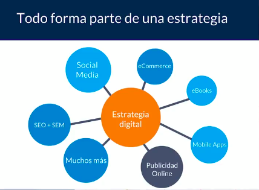
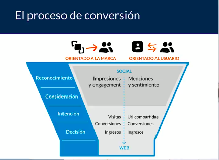
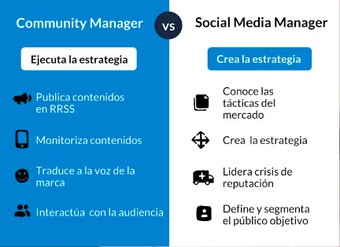
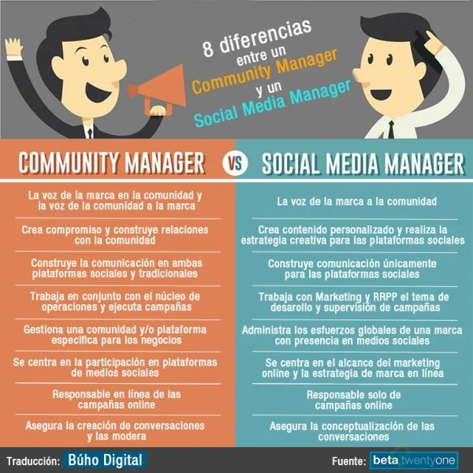

# Community Manager
## ¿Para que sirven las redes sociales?
Un contenido efectivo puede atraer la atención de potenciales clientes

## Beneficios
- Exposición y reconocimiento
- Ventas
- Trafico hacia un sitio web
- Branding
- Posicionamiento en buscadores
- Seguidores

## Objetivos
- Entretener
- Informar
- No vender directamente
- Dirigir trafico
- Conversar

## Estrategia Digital
Estrategia digital -> Conjunto de tácticas

### Proceso de conversión
Embudo de conversión: Es entender como un usuario tiene acciones a partir de lo que estamos creando.

## El/La Community Manager
Los Community Managers son las personas que gestionan los contenidos de las Redes Sociales dentro de una Estrategia Digital. La ejecución debe ser táctica entendiendo la responsabilidad al transmitir la voz de nuestro cliente. Trabajamos de la mano del cliente o del Social Media Manager para ejecutar el mejor mensaje posible. Estar en constante contacto con la audiencia es su labor principal.

Un Community Manager:

- Es el puente entre el cliente y la comunidad
- Es responsable de la voz de la marca
- Escucha

## Diferencias entre Community Manager y Social Media Manager

