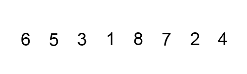

# Algoritmos de búsqueda y ordenación 

## Búsqueda lineal

La **búsqueda lineal** es un algoritmo muy sencillo. Consta en buscar si un elemento se encuentra dentro de una lista, array o un sistema ordenado o no ordenado para poder determinar si el elemento se encuentra en el o forma parte de el.

¿Cuál es el peor caso del siguiente código? Si nos fijamos existe un **for loop** que crece según el tamaño de la lista, por lo cual nuestro Big O es O(n).

```python
import random

def busqueda_lineal(lista, objetivo):
    match = False

    for elemento in lista: # O(n)
        if elemento == objetivo:
            match = True
            break

    return match


if __name__ == '__main__':
    tamano_de_lista = int(input('De que tamano sera la lista? '))
    objetivo = int(input('Que numero quieres encontrar? '))

    lista = [random.randint(0, 100) for i in range(tamano_de_lista)]

    encontrado = busqueda_lineal(lista, objetivo)
    print(lista)
    print(f'El elemento {objetivo} {"esta" if encontrado else "no esta"} en la lista')
```

## Búsqueda binaria

La **búsqueda binaria** toma una estrategia llamada "Divide y conquista", la cual consiste en dividir el problema en 2 en cada iteración. Este algoritmo asume que la lista se encuentra ordenada, por lo que es necesario realizar este paso primero.

La **búsqueda binaria** es uno de los mejores algoritmos que se tienen hoy en día para búsqueda, ya que reduce significativamente el numero de pasos, y así disminuyendo nuestro Big O.

#### Caso Promedio


#### Peor de los Casos


#### Mejor de los Casos


Para ver de forma practica haremos una búsqueda binaria a través de código. Lo primero que tenemos que realizar es ordenar nuestra lista antes de ejecutar la búsqueda.

```python
import random

def busqueda_binaria(lista, comienzo, final, objetivo):
    print(f'buscando {objetivo} entre {lista[comienzo]} y {lista[final - 1]}')
    if comienzo > final:
        return False

    medio = (comienzo + final) // 2

    if lista[medio] == objetivo:
        return True
    elif lista[medio] < objetivo:
        return busqueda_binaria(lista, medio + 1, final, objetivo)
    else:
        return busqueda_binaria(lista, comienzo, medio - 1, objetivo)


if __name__ == '__main__':
    tamano_de_lista = int(input('De que tamano es la lista? '))
    objetivo = int(input('Que numero quieres encontrar? '))

    lista = sorted([random.randint(0, 100) for i in range(tamano_de_lista)])

    encontrado = busqueda_binaria(lista, 0, len(lista), objetivo)

    print(lista)
    print(f'El elemento {objetivo} {"esta" if encontrado else "no esta"} en la lista')
```

## Ordenamiento de burbuja

El primer algoritmo de ordenamiento que veremos es el **ordenamiento de burbuja**. Es un algoritmo que recorre repetidamente una lista que necesita ordenarse. Compara elementos adyacentes y los intercambia si están en el orden incorrecto. Este procedimiento se repite hasta que no se requiere mas intercambios, lo que indica que la lista se encuentra ordenada.



```python
import random


def ordenamiento_de_burbuja(lista):
    n = len(lista)

    for i in range(n):
        for j in range(0, n - i - 1): # O(n) * O(n) = O(n * n) = O(n**2)

            if lista[j] > lista[j + 1]:
                lista[j], lista[j + 1] = lista[j + 1], lista[j]

    return lista

if __name__ == '__main__':
    tamano_de_lista = int(input('De que tamano sera la lista? '))

    lista = [random.randint(0, 100) for i in range(tamano_de_lista)]
    print(lista)

    lista_ordenada = ordenamiento_de_burbuja(lista)
    print(lista_ordenada)
```

## Ordenamiento por inserción

El ordenamiento por inserción es uno de los algoritmos más comunes que estudian los Científicos del Cómputo. Es intuitivo y fácil de implementar, pero es muy ineficiente para listas de gran tamaño.

Una de las características del ordenamiento por inserción es que ordena en “su lugar.” Es decir, no requiere memoria adicional para realizar el ordenamiento ya que simplemente modifican los valores en memoria.

La definición es simple:

```python
Una lista es dividida entre una sublista ordenada y otra sublista desordenada. Al principio, la sublista ordenada contiene un solo elemento, por lo que por definición se encuentra ordenada.

A continuación se evalua el primer elemento dentro la sublista desordenada para que podamos insertarlo en el lugar correcto dentro de la lista ordenada.

La inserción se realiza al mover todos los elementos mayores al elemento que se está evauluando un lugar a la derecha.

Continua el proceso hasta que la sublista desordenada quede vacia y, por lo tanto, la lista se encontrará ordenada.
```

Veamos un ejemplo:

Imagina que tienes la siguiente lista de números:

7, 3, 2, 9, 8

Primero añadimos 7 a la sublista ordenada:

**7**, 3, 2, 9, 8

Ahora vemos el primer elemento de la sublista desordenada y lo guardamos en una variable para mantener el valor. A esa variable la llamaremos `valor_actual`. Verificamos que 3 es menor que 7, por lo que movemos 7 un lugar a la derecha.

**7**, 7, 2, 9, 8 (valor_actual=3)

3 es menor que 7, por lo que insertamos el valor en la primera posición.

**3, 7**, 2, 9, 8

Ahora vemos el número 2. 2 es menor que 7 por lo que lo movemos un espacio a la derecha y hacemos lo mismo con 3.

**3, 3, 7**, 9, 8 (valor_actual=2)

Ahora insertamos 2 en la primera posición.

**2, 3, 7**, 9, 8

9 es más grande que el valor más grande de nuestra sublista ordenada por lo que lo insertamos directamente en su posición.

**2, 3, 7, 9**, 8

El último valor es 8. 9 es más grande que 8 por lo que lo movemos a la derecha:

**2, 3, 7, 9**, 9 (valor_actual=8)

8 es más grande que 7, por lo que procedemos a insertar nuestro valor_actual.

**2, 3, 7, 8, 9**

Ahora la lista se encuentra ordenada y no quedan más elementos en la sublista desordenada.

Antes de ver la implementación en Python, trata de implementarlo por ti mismo y compártenos tu algoritmo en la sección de comentarios.

Esta es una forma de implementar el algoritmo anterior:

```python
def ordenamiento_por_insercion(lista):

    for indice in range(1, len(lista)):
        valor_actual = lista[indice]
        posicion_actual = indice

        while posicion_actual > 0 and lista[posicion_actual - 1] > valor_actual:
            lista[posicion_actual] = lista[posicion_actual - 1]
            posicion_actual -= 1

        lista[posicion_actual] = valor_actual
```

## Ordenamiento por mezcla

El **ordenamiento por mezcla** creado por **John von Neumann** el cual aplica el concepto de "divide y conquista". Primero divide una lista en partes iguales hasta que quedan sublistas de 1 o 0 elementos. Luego las recombina en forma ordenada.


```python
import random

def ordenamiento_por_mezcla(lista):
    if len(lista) > 1:
        medio = len(lista) // 2
        izquierda = lista[:medio]
        derecha = lista[medio:]
        print(izquierda, '*' * 5, derecha)

        # llamada recursiva en cada mitad
        ordenamiento_por_mezcla(izquierda)
        ordenamiento_por_mezcla(derecha)

        # Iteradores para recorrer las dos sublistas
        i = 0
        j = 0
        # Iterador para la lista principal
        k = 0

        while i < len(izquierda) and j < len(derecha):
            if izquierda[i] < derecha[j]:
                lista[k] = izquierda[i]
                i += 1
            else:
                lista[k] = derecha[j]
                j += 1

            k += 1

        while i < len(izquierda):
            lista[k] = izquierda[i]
            i += 1
            k +=1

        while j < len(derecha):
            lista[k] = derecha[j]
            j += 1
            k += 1
        
        print(f'izquierda {izquierda}, derecha {derecha}')
        print(lista)
        print('-' * 50)

    return lista


if __name__ == '__main__':
    tamano_de_lista = int(input('De que tamano sera la lista? '))

    lista = [random.randint(0, 100) for i in range(tamano_de_lista)]
    print(lista)
    print('-' * 20)

    lista_ordenada = ordenamiento_por_mezcla(lista)
    print(lista_ordenada)
```